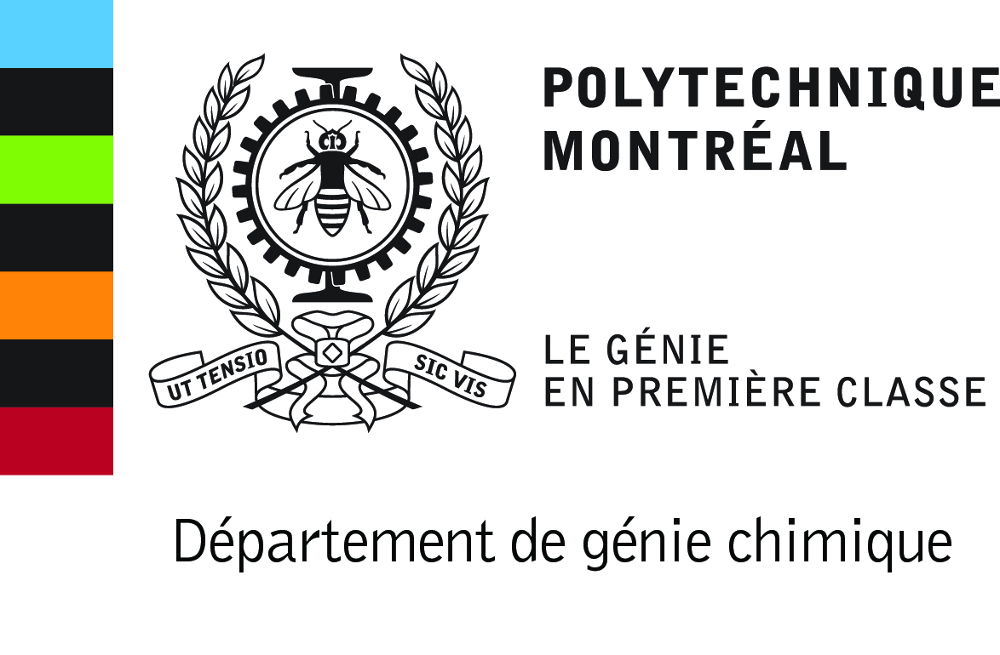
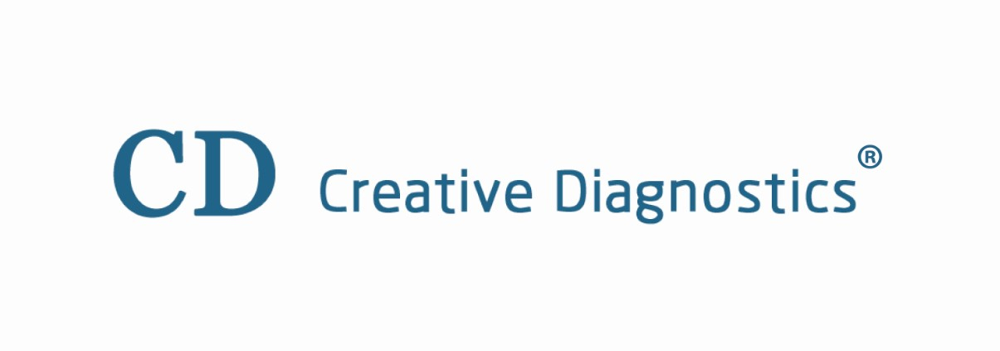

[Vice-Rector for Student Affairs and Studies](//recteur.umontreal.ca/equipe-de-direction/vice-rectrice-aux-affaires-etudiantes-et-aux-etudes/equipe)

[Vice-Rector for International Affairs and Francophony](//recteur.umontreal.ca/equipe-de-direction/vice-recteur-aux-affaires-internationales-et-a-la-francophonie/equipe)

[Regional Mass Spectrometry Centre](//en.chimie.umontreal.ca/research/the-departments-analysis-services/regional-mass-spectrometry-centre)

